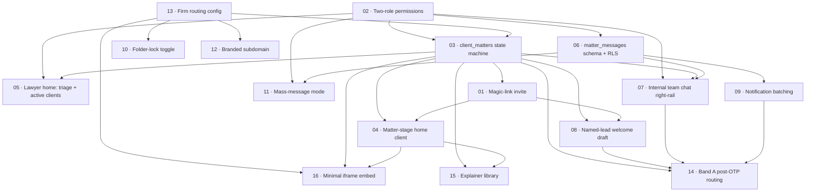

# S8 Phase 1: Sequencing and dependency map

**Companion to:** `S8.Phase1.epic.md`

## Dependency graph (Mermaid)

## Critical path

The shortest dependency chain to a working end-to-end Band A flow:

1. **S02** Two-role permissions (admin / staff / operator / client)
2. **S13** Firm routing config (intake_firms columns)
3. **S03** client_matters state machine + take-handler matter creation
4. **S01** Magic-link invite (depends on S03)
5. **S06** matter_messages schema (depends on S02 for role gating)
6. **S08** Named-lead welcome draft (depends on S01, S03, S13)
7. **S14** Band A post-OTP routing pipeline (composes S03, S08, S07, S09)

These seven stories form the critical path. The other nine stories layer surfaces and polish on top of this core.

## Parallel batches

After the critical-path schema stories (S02, S03, S06, S13) land, the remaining 12 stories split into batches that can run in parallel against the same base.

### Batch A: surfaces (parallel after schema)
- S01 Magic-link invite
- S04 Matter-stage home client
- S05 Lawyer home: triage + active clients
- S07 Internal team chat right-rail (depends on S06, parallel after that)

### Batch B: polish (parallel after surfaces)
- S08 Named-lead welcome draft
- S09 Notification batching
- S10 Folder-lock toggle
- S11 Mass-message mode
- S15 Explainer library
- S16 Minimal iframe embed

### Batch C: integration (after batches A and B)
- S12 Branded subdomain
- S14 Band A post-OTP routing pipeline

## Recommended @dev session order

A single sequential plan that respects the dependencies and keeps each session in a focused scope:

| Session | Stories | Rationale |
|---|---|---|
| 1 | S13 + S02 | Both are pure schema and role-model work. Land together, run migrations once. |
| 2 | S03 + S06 | Schema for matters and messages. Both small, both critical-path. |
| 3 | S01 + S04 | Client magic-link + client home. Pair because they ship the first end-to-end client surface. |
| 4 | S07 + S05 | Lawyer home and right-rail chat. Pair because they ship the first end-to-end lawyer surface. |
| 5 | S08 | Welcome draft. Tight focus; substantial copy and template work. |
| 6 | S09 | Notification batching. Pure infrastructure, cron-scheduled. |
| 7 | S14 | Take pipeline composition. Wires the side effects of S03, S08, S07, S09. |
| 8 | S10 + S11 | Folder lock + mass message. Both small, both touch existing surfaces. |
| 9 | S15 | Explainer library. Scaffolds the table; operator authors the content separately. |
| 10 | S16 + S12 | Embed + subdomain. Both small, both schema-light. |

Total: 10 sessions for 16 stories. Critical path lands in sessions 1-7; polish lands in 8-10.
